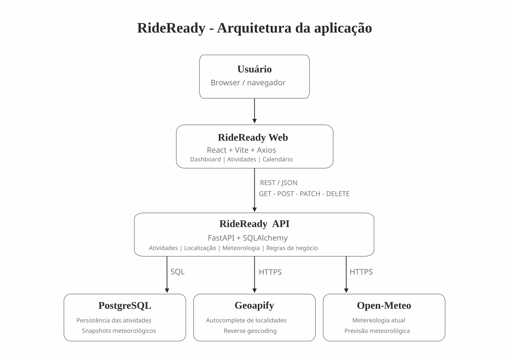

# RideReady

Aplicação web para planeamento inteligente de atividades ao ar livre, permitindo organizar atividades, consultar condições meteorológicas e visualizar o planeamento através de uma interface responsiva.

O **RideReady Web** é o componente principal de interface do projeto e comunica através de uma API REST independente, responsável pela persistência das atividades, integração com serviços de localização e obtenção de dados meteorológicos.

## Funcionalidades

O RideReady disponibiliza:

- criação, consulta, edição e eliminação de atividades;
- atividades dos tipos caminhada, corrida, ciclismo, trilho e outras;
- estados `PLANNED`, `COMPLETED` e `CANCELLED`;
- pesquisa e autocomplete de localidades;
- consulta da previsão meteorológica associada às atividades;
- avaliação das condições meteorológicas;
- persistência do último snapshot meteorológico consultado;
- deteção de conflitos de data e hora;
- filtros por pesquisa, estado, tipo e período;
- seleção e eliminação de múltiplas atividades;
- dashboard com resumo das atividades;
- condições meteorológicas da localização atual do utilizador;
- próximas atividades planeadas;
- calendário mensal;
- resumo mensal por estado;
- consulta dos detalhes de uma atividade através do calendário;
- atualização da previsão meteorológica de atividades planeadas;
- interface responsiva para diferentes dimensões de ecrã.

## Tecnologias utilizadas

- **React 19** — construção da interface.
- **Vite 8** — ambiente de desenvolvimento e build.
- **JavaScript** — linguagem utilizada no frontend.
- **HTML5** — estrutura da interface.
- **CSS3** — estilos e responsividade.
- **Axios** — comunicação HTTP com a RideReady API.
- **Oxlint** — análise estática do código JavaScript/React.
- **Docker** — criação do container do frontend.
- **Docker Compose** — orquestração do ambiente completo.

## Arquitetura

### Diagrama da arquitetura



O RideReady utiliza componentes independentes que comunicam através de HTTP/JSON.

```text
Utilizador
    |
    v
RideReady Web
React + Vite
    |
    | REST / JSON
    v
RideReady API
FastAPI
    |
    +-------------------+
    |                   |
    v                   v
PostgreSQL          APIs externas
                    |
                    +-- Geoapify
                    +-- Open-Meteo
```

O frontend não acede diretamente à base de dados nem às APIs externas. Essas responsabilidades pertencem à RideReady API.

## Componentes do projeto

O MVP é composto por:

### RideReady Web

Interface principal desenvolvida em React.

Responsabilidades:

- interação com o utilizador;
- apresentação das atividades;
- formulários e filtros;
- dashboard;
- calendário;
- apresentação dos dados meteorológicos;
- comunicação com a RideReady API.

### RideReady API

API REST independente desenvolvida em FastAPI.

Responsabilidades:

- CRUD das atividades;
- validação das regras de negócio;
- persistência PostgreSQL;
- pesquisa e normalização de localidades;
- integração com Geoapify;
- integração com Open-Meteo;
- avaliação das condições meteorológicas.

### Geoapify

API externa utilizada para pesquisa de localidades, autocomplete e geocodificação reversa.

### Open-Meteo

API externa utilizada para obter condições meteorológicas atuais e previsões.

### PostgreSQL

Base de dados relacional utilizada para persistência das atividades e do último snapshot meteorológico.

## Estrutura do frontend

```text
rideready-web/
├── public/
│   ├── activity-images/
│   │   ├── cycling.jpg
│   │   ├── hiking.jpg
│   │   ├── other.jpg
│   │   ├── running.jpg
│   │   └── walking.jpg
│   ├── favicon.svg
│   └── icons.svg
├── src/
│   ├── assets/
│   │   ├── icons/
│   │   ├── images/
│   │   └── logo/
│   ├── components/
│   │   ├── ActivityCard.jsx
│   │   ├── ActivityFilters.jsx
│   │   ├── ActivityForm.jsx
│   │   ├── ActivityList.jsx
│   │   ├── EmptyState.jsx
│   │   ├── Header.jsx
│   │   └── LocationAutocomplete.jsx
│   ├── pages/
│   │   ├── ActivitiesPage.jsx
│   │   ├── CalendarPage.jsx
│   │   └── DashboardPage.jsx
│   ├── services/
│   │   └── api.js
│   ├── styles/
│   │   ├── calendar.css
│   │   └── theme.css
│   ├── utils/
│   │   └── apiError.js
│   ├── App.css
│   ├── App.jsx
│   ├── index.css
│   └── main.jsx
├── .dockerignore
├── .env.example
├── .gitignore
├── .oxlintrc.json
├── compose.yaml
├── Dockerfile
├── index.html
├── package.json
├── package-lock.json
├── vite.config.js
└── README.md
```

## Áreas da aplicação

### Visão geral

A página inicial apresenta um resumo das atividades registadas:

- total de atividades;
- atividades planeadas;
- atividades concluídas;
- atividades canceladas;
- próximas atividades planeadas.

Quando o utilizador autoriza o acesso à geolocalização do navegador, o Dashboard utiliza as coordenadas para apresentar:

- localização atual;
- temperatura;
- sensação térmica;
- probabilidade de precipitação;
- velocidade do vento;
- rajadas de vento;
- descrição das condições meteorológicas.

A localização é obtida através da RideReady API, que utiliza geocodificação reversa.

### Atividades

A área de atividades concentra as principais operações de gestão.

Permite:

- criar uma atividade;
- editar uma atividade;
- eliminar uma atividade;
- concluir atividades;
- cancelar atividades;
- consultar e atualizar a previsão meteorológica;
- pesquisar por título ou localização;
- filtrar por estado;
- filtrar por tipo;
- filtrar por período;
- selecionar múltiplas atividades;
- eliminar atividades selecionadas.

Quando existe outra atividade exatamente na mesma data e hora, a interface informa o utilizador e permite confirmar explicitamente se pretende manter o conflito.

### Calendário

O calendário organiza visualmente as atividades por mês e por dia.

Disponibiliza:

- navegação entre meses;
- resumo mensal;
- identificação das atividades por dia;
- próximas atividades do mês;
- seleção de uma data;
- detalhes das atividades desse dia;
- modal com os detalhes da atividade;
- último snapshot meteorológico;
- atualização da previsão de atividades planeadas;
- ligação direta para a atividade na área de gestão.

## Integração REST

O frontend utiliza Axios para comunicar com a RideReady API.

A URL base é configurada através da variável:

```env
VITE_API_URL=http://localhost:8000
```

Entre os endpoints consumidos pela interface encontram-se:

| Método | Endpoint | Utilização |
| --- | --- | --- |
| `GET` | `/activities` | Carregar atividades |
| `POST` | `/activities` | Criar atividade |
| `PATCH` | `/activities/{id}` | Atualizar atividade |
| `DELETE` | `/activities/{id}` | Eliminar atividade |
| `GET` | `/activities/{id}/weather` | Consultar previsão |
| `GET` | `/locations/search` | Pesquisar localidades |
| `GET` | `/locations/reverse` | Identificar localização atual |
| `GET` | `/weather/current` | Consultar condições atuais |

Dessa forma, a interface realiza operações reais através dos métodos HTTP `GET`, `POST`, `PATCH` e `DELETE`.

## Configuração do ambiente

Crie um ficheiro `.env` na raiz do frontend com base no `.env.example`:

```env
VITE_API_URL=http://localhost:8000
```

A variável `VITE_API_URL` define o endereço da RideReady API utilizado pelo Axios.

## Instalação local

### Pré-requisitos

Para executar apenas o frontend localmente:

- Node.js;
- npm;
- RideReady API disponível.

Para executar o ambiente completo através de containers:

- Docker;
- Docker Compose.

### 1. Instalar as dependências

Na raiz do `rideready-web`:

```powershell
npm ci
```

### 2. Configurar o ambiente

Crie o `.env` com base no `.env.example`.

Exemplo:

```env
VITE_API_URL=http://localhost:8000
```

### 3. Iniciar o frontend

```powershell
npm run dev
```

O Vite disponibilizará o endereço local da aplicação no terminal.

No ambiente padrão do projeto:

```text
http://localhost:5173
```

## Scripts

Os scripts disponíveis no `package.json` são:

| Comando | Função |
| --- | --- |
| `npm run dev` | Inicia o servidor de desenvolvimento |
| `npm run build` | Gera o build de produção |
| `npm run lint` | Executa a análise estática com Oxlint |
| `npm run preview` | Executa localmente o build gerado |

## Qualidade do código

Para executar a análise estática:

```powershell
npm run lint
```

Para validar o build:

```powershell
npm run build
```

Esses comandos devem ser executados antes da entrega para confirmar que o frontend continua válido.

## Docker

O frontend possui um `Dockerfile` próprio na raiz do repositório.

Para construir apenas a imagem do frontend:

```powershell
docker build -t rideready-web .
```

O container executa o build da aplicação e utiliza o servidor de preview do Vite na porta:

```text
5173
```

## Ambiente completo com Docker Compose

O `compose.yaml` encontra-se na raiz deste repositório, que funciona como repositório principal do MVP.

Para executar o ambiente completo, os dois repositórios devem estar lado a lado:

```text
RideReady/
├── rideready-api/
└── rideready-web/
```

A RideReady API necessita de um ficheiro `.env` contendo a chave da Geoapify.

A partir de `rideready-web`, execute:

```powershell
docker compose up -d --build
```

O Compose cria e executa:

```text
rideready-web
rideready-api
PostgreSQL
```

Durante a inicialização da API, as migrations do Alembic são aplicadas automaticamente.

Após a inicialização:

```text
Web:     http://localhost:5173
API:     http://localhost:8000
Swagger: http://localhost:8000/docs
```

Para verificar os containers:

```powershell
docker compose ps
```

Para parar o ambiente:

```powershell
docker compose down
```

O volume PostgreSQL não é removido por esse comando, preservando os dados.

> Não utilize `docker compose down -v` se pretender preservar o volume e os dados armazenados.

## Persistência

As atividades não são armazenadas no navegador.

O RideReady Web envia as operações para a RideReady API, que persiste os dados em PostgreSQL.

No ambiente Docker Compose, o PostgreSQL utiliza um volume persistente denominado no Compose como:

```text
rideready-postgres-data
```

Isso permite preservar os dados mesmo quando os containers são parados e recriados.

## Tratamento de erros

O frontend possui tratamento centralizado das mensagens devolvidas pela API através de:

```text
src/utils/apiError.js
```

Além disso, as páginas apresentam mensagens contextuais para situações como:

- falha ao carregar atividades;
- falha ao criar ou atualizar;
- falha ao eliminar;
- conflito de horário;
- indisponibilidade da previsão meteorológica;
- indisponibilidade da pesquisa de localização;
- impossibilidade de obter a localização atual.

## Geolocalização

O Dashboard utiliza a API de geolocalização disponibilizada pelo navegador.

A localização somente é obtida quando o navegador disponibiliza esse recurso e o utilizador concede a respetiva permissão.

As coordenadas são enviadas para a RideReady API para:

- obter as condições meteorológicas atuais;
- identificar a localização através de geocodificação reversa.

## Responsividade

A interface foi preparada para diferentes dimensões de ecrã, incluindo desktop, tablet e dispositivos móveis.

O layout adapta elementos como:

- navegação;
- cartões de atividades;
- filtros;
- dashboard;
- calendário;
- formulários;
- modais.

## APIs externas

As integrações externas são realizadas pela RideReady API, e não diretamente pelo navegador.

### Geoapify

Utilizada para:

- autocomplete;
- pesquisa de localidades;
- geocodificação reversa.

A chave da Geoapify permanece configurada exclusivamente no backend e não é exposta através de `VITE_API_URL` ou do código do frontend.

### Open-Meteo

Utilizada para:

- condições meteorológicas atuais;
- previsão das atividades.

O frontend apresenta os dados recebidos da RideReady API e identifica a Open-Meteo como fonte dos dados meteorológicos no Dashboard.

## Repositórios

O projeto mantém os componentes desenvolvidos em repositórios independentes:

```text
rideready-web
rideready-api
```

Essa separação permite que frontend e backend sejam desenvolvidos, versionados, construídos e executados de forma independente.

## Documentação da API

Com a RideReady API em execução, a documentação interativa Swagger está disponível em:

```text
http://localhost:8000/docs
```

A documentação OpenAPI está disponível em:

```text
http://localhost:8000/openapi.json
```

## Projeto académico

O RideReady foi desenvolvido como MVP académico aplicando conceitos de arquitetura distribuída, APIs REST, persistência de dados, integração com APIs externas, containers e desenvolvimento de interfaces web responsivas.